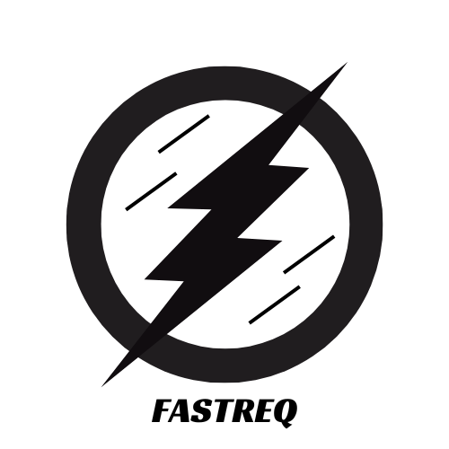
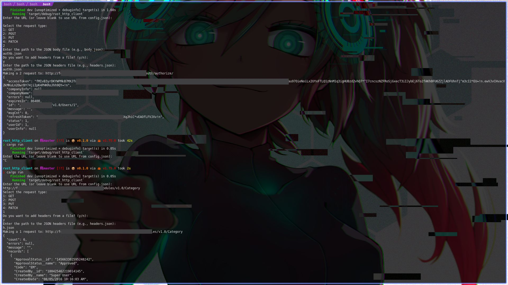

# 
# Api testing tool made with rust to use for api developement (Kind of Tui)

This Rust project provides a simple yet powerful tool for making HTTP requests and handling responses. Built with `reqwest` for performing HTTP requests, `tokio` for asynchronous runtime, and `serde_json` for JSON parsing, it offers functionalities to make GET, POST, PUT, and PATCH requests, manage request headers and body, and pretty-print JSON responses.




## Features

- Support for various HTTP methods: GET, POST, PUT, PATCH.
- JSON body and headers configuration via external files.
- Pretty-printing JSON responses directly within the application.
- Configuration through a `config.json` file for default values.
- Synchronous reading of user inputs and asynchronous request handling.

## Requirements

- Rust programming language
- Cargo package manager

## Installation

1. Clone the repository to your local machine:

```bash
git clone https://github.com/Kythonlk/rust-api-client.git
cd rust-api-client
```

2. Build the project:

```bash
cargo build
```

3. Run the project:

```bash
cargo run
```

## Usage

After running the application, follow the on-screen prompts to:

1. Enter the URL or leave blank to use the URL from `config.json`.
2. Select the request type (GET, POST, PUT, PATCH).
3. If applicable, specify the path to the JSON body file for POST, PUT, or PATCH requests.
4. Decide whether to add headers from a file and specify the path to the JSON headers file if yes.
5. View the pretty-printed JSON response or raw response text in the console.

## Configuration

- `config.json`: Set default values for the URL and any other configurations you might need.
- JSON files for request bodies and headers: Format according to the requirements of your API endpoint.

## Contributing

Contributions are welcome! Please feel free to submit a pull request or open an issue for any bugs, feature requests, or improvements.
